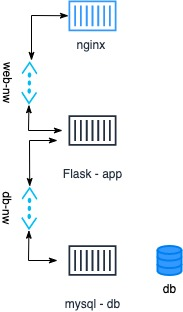
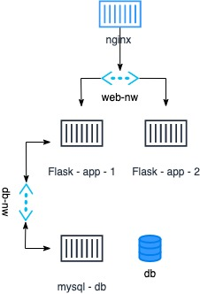

# Scaling Out!

Now, you have already deployed a flask app along with the db but well, how would you scale it?
One instance is definetely not enough right!?

So, lets get our hands dirty and learn how to scale this deployment!
We have understood the value of `docker-compose` in the last phase and hence I will not dive into
performing the scaling manually.

Let us first, add a nginx proxy server to our app so that we can scale our app instances when needed.
1. `mkdir conf.d; cd conf.d`
2. Now, need to create the `flaskapp.conf`

Instead of creating a separate nginx conatiner manually, we add details to the `docker-compose.yml`

Since, we do not want the nginx container to be able to communicate with our Database directly in accordance with (Principal of least privilege).
We will create two network bridges, one for nginx to communicate with the app and another for app and db.
We can do this very easily, just by adding the `network` section in the yaml.
Then, we need to add the networks `web_nw` to nginx and app and `db_nw` to app and db.

Notice, in the last yml we had `links` to declare dependency of app on db, but here we use `depends_on`.
That is because, `links` is deprecated.

So, now we have 3 containers and 2 networks!
Lets visualise what it looks like :

<!--  -->

  

All good?!
Lets run this!

Run `docker-compose up -d` and head to `http://localhost:8080/subjects`

Do you see the same output?

`docker-compose down` this should bring your deployment down, remove the networks etc.

Ok, lets scale out the app!

`docker-compose up -d --scale app=2`

Observe that 2 app instances are spawned instead of just one.

`docker-compose logs -f`

This will help you view logs. Head to the same URL and simultaneously observe the logs. You should see that every request is redirected in round robin fashion.

  

>